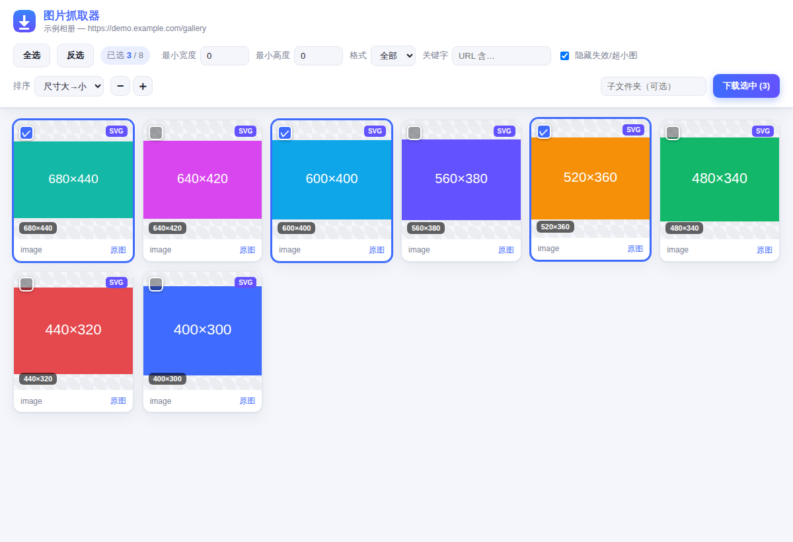

# 图片抓取器 · Image Grabber

一个仿照 [Fatkun 图片批量下载](https://chrome.google.com/webstore) 的 Chrome 扩展（Manifest V3）。
点击工具栏图标即可抓取**当前页面的所有图片**，在一个整洁的结果页里预览、筛选、批量选择并下载。



## ✨ 功能特性

- **全面抓取**：不止 ``，还包括
  - `srcset` / `<picture>` 响应式图片（自动取最高分辨率）
  - 常见懒加载属性（`data-src`、`data-original`、`data-lazy-src` 等）
  - CSS `background-image`（含 `::before` / `::after` 伪元素）
  - 指向图片文件的 `<a>` 直链、`<video poster>` 视频封面
  - 页面内嵌 `<svg>`（序列化为可下载的图片）
  - **iframe 内的图片**（注入所有 frame）
- **缩略图网格预览**，显示尺寸、格式徽标，缩略图大小可缩放
- **多维筛选**：最小宽度 / 最小高度 / 图片格式 / URL 关键字 / 隐藏失效与超小图
- **排序**：尺寸大→小、小→大、页面顺序、文件名
- **批量操作**：全选 / 反选 / 单击选择，一键下载选中项
- **自定义子文件夹**：下载到 `下载目录/你的子文件夹/` 下，自动去重命名
- **深浅色主题自适应**，纯前端、无任何第三方依赖、不上传任何数据

## 📦 安装（开发者模式加载未打包扩展）

1. 打开 Chrome（或 Edge），地址栏访问 `chrome://extensions`
2. 打开右上角 **开发者模式**
3. 点击 **加载已解压的扩展程序**，选择本 `image-grabber` 目录
4. 工具栏出现蓝色下载图标即安装成功

> 图标已随仓库提供。如需重新生成：`python3 icons/make_icons.py`

## 🖱️ 使用方法

1. 打开任意网页，等图片加载出来（尤其是需要滚动触发的懒加载图，建议先滚到底）
2. 点击工具栏的 **图片抓取器** 图标
3. 自动打开结果页，展示本页抓到的全部图片
4. 用顶部筛选器缩小范围 → 勾选需要的图片（或「全选」）
5. 可填写子文件夹名 → 点击 **下载选中**

## 🗂️ 目录结构

```
image-grabber/
├── manifest.json        # MV3 清单
├── background.js        # 后台 service worker：注入采集、汇总、打开结果页、处理下载
├── collector.js         # 注入到页面执行的图片采集脚本
├── grabber.html/.css/.js# 抓取结果页（预览 / 筛选 / 选择 / 下载）
├── icons/               # 图标及生成脚本
└── tests/               # Playwright 自动化测试与截图脚本
```

## 🔒 权限说明

| 权限 | 用途 |
| --- | --- |
| `activeTab` / `scripting` | 点击图标时把采集脚本注入当前标签页 |
| `downloads` | 调用浏览器下载能力保存图片 |
| `storage` | 在结果页与后台之间临时传递本次抓取的图片列表（仅本地） |
| `host_permissions: <all_urls>` | 允许在任意网站上抓取（脚本仅在你点击图标时运行） |

扩展不会收集、上传或分享任何数据，所有处理都在本地完成。

## 🧪 测试

依赖仓库环境中的 Playwright + Chromium：

```bash
cd tests
node test_collector.mjs   # 验证各类图片来源的采集逻辑（12 项断言）
node test_e2e.mjs         # 加载真实扩展，验证渲染/筛选/选择/下载全流程
node shot.mjs             # 生成界面预览截图 ui-preview.png
```

## ⚠️ 说明与限制

- 部分网站有**防盗链（Referer 校验）**，个别图片可能无法下载，属正常现象。
- 浏览器内置页面（`chrome://`、扩展商店等）出于安全限制无法抓取。
- `blob:` 临时地址在扩展上下文中可能已失效，能抓到 URL 但不一定能下载。
